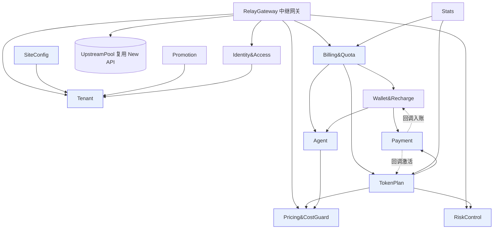
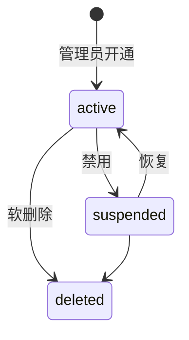
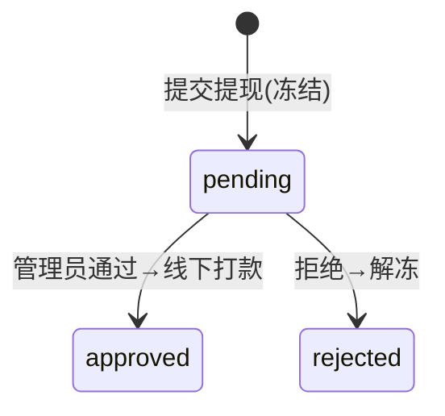
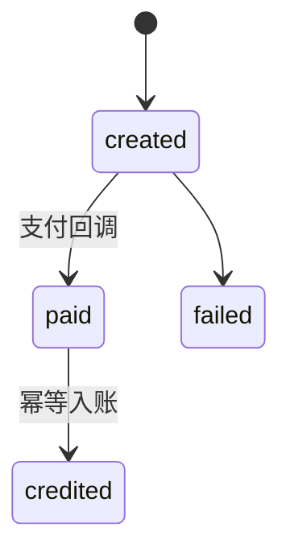
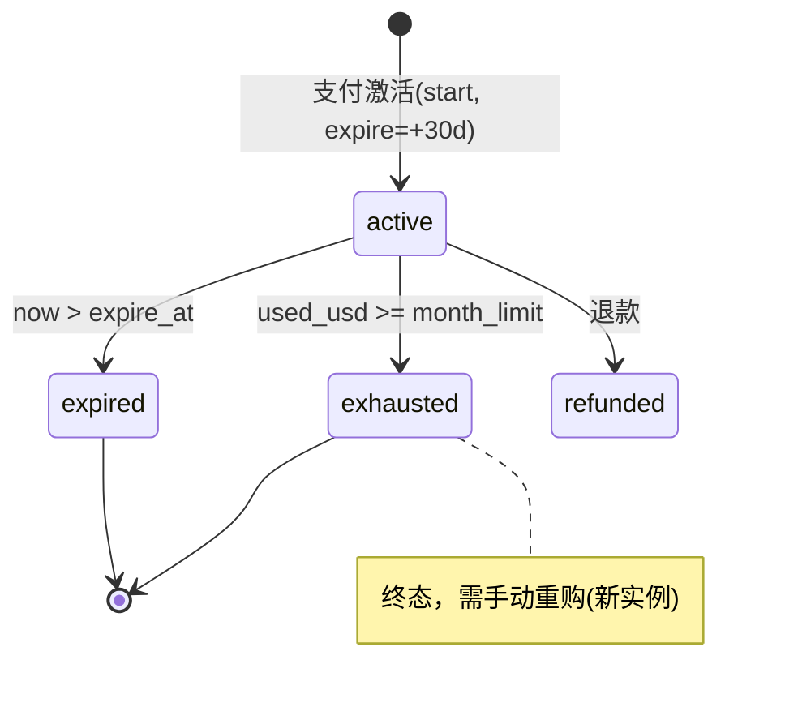
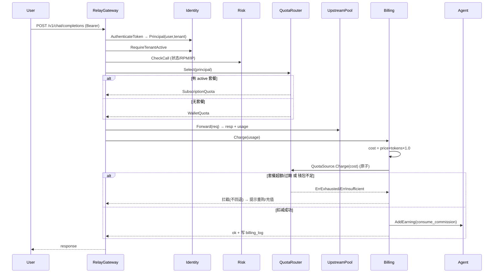
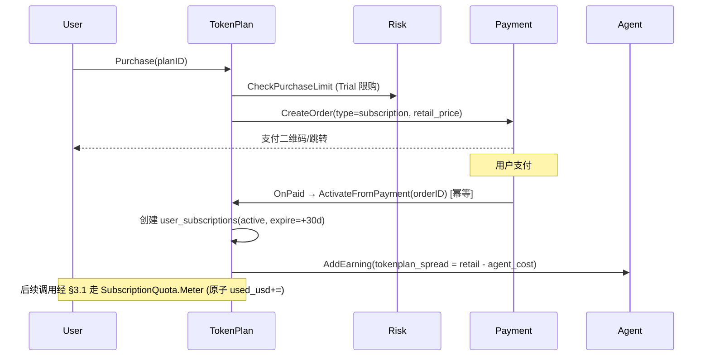
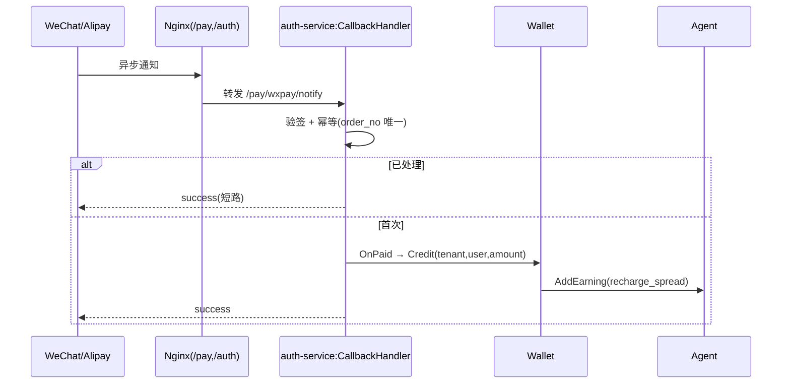
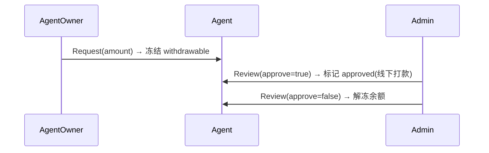

# New API 多租户代理分销平台 — 详细设计文档

> **依据**：需求文档 [`proposal.md`](proposal.md) v2.0（权威）。
> **架构形态**：模块化单体（New API fork，Gin + GORM）；领域分包，包间**仅通过接口依赖（依赖倒置）**，支付回调走独立 `auth-service`。
> **设计范围**：**增量为主** —— 详设新增/改造模块；复用的 New API 模块只标注接口契约与改造点。
> **核心原则**：低耦合、高内聚，**每个模块可 mock 依赖独立单测**。
> **默认假设**：`x1` = 模型上游成本价 ×1.0（不叠分组倍率）；引入 Redis；Trial 限购 = 用户∪实名∪设备 各 1 次；额度桶**独立计量不回退**。

---

## 目录

1. 架构总览
2. 模块详细设计（13 模块 × 职责/接口/数据模型/流程/错误码/单测）
3. 端到端关键数据流
4. 模块独立性与测试矩阵
5. 包结构与目录布局
6. 横切实现细节（事务 / 并发一致性 / 缓存 / 错误码体系）
7. 默认假设与待确认

---

## 1. 架构总览

### 1.1 分层与依赖方向

```text
入口层   Handler(Gin)  ── 仅做参数校验、鉴权前置、调用 Service
应用层   Service       ── 业务编排，依赖“消费者接口”而非具体实现
领域层   Domain/Model  ── 实体、状态机、纯业务规则（无 IO，最易单测）
基础设施 Repo/Adapter  ── GORM、Redis、上游 HTTP、支付 SDK，实现领域定义的接口
```

依赖方向**单向向内**：Handler → Service → Domain ← Repo（Repo 实现 Domain 接口）。任何模块**不得 import 兄弟模块的具体包**，只 import 自己声明的接口（见 §1.4）。

### 1.2 模块依赖图（低耦合）



> 蓝色=新增/重改造模块（详设重点）；`UpstreamPool/Model/Log` 复用 New API。所有箭头都是**接口依赖**，运行时由 `cmd/main` 组装（依赖注入）。

### 1.3 横切关注点（全模块统一）

| 关注点 | 约定 |
| --- | --- |
| 租户上下文 | `ctx` 携带 `Principal{UserID, TenantID, Role}`；Repo 统一 `scopeByTenant(db, tenantID)` 强制注入 |
| 事务边界 | 在 Service 层用 `txn.WithTx(ctx, fn)`；跨模块写（如扣费+收益）在同一事务内 |
| 并发一致性 | 额度扣减用**条件 UPDATE / 行锁**（§6.2） |
| 错误模型 | 统一 `AppError{Code, Msg, HTTPStatus}`；模块只返回自己命名空间的错误码（§6.4） |
| 缓存 | Redis：Host→tenant 解析、限流计数、满额预警标记；写后失效 |
| 日志/审计 | 计费、收益、入账、提现、下架等关键写操作必须落审计日志 |

### 1.4 低耦合机制：消费者定义接口（Consumer-Defined Interfaces）

每个模块在自己的 `port.go` 里声明**它需要的依赖接口**，而不是 import 依赖方的包。例如 `RelayGateway` 自己定义它需要的 `QuotaRouter`，`Billing&Quota` 提供一个满足该签名的实现，二者**编译期零直接耦合**，由 `main` 装配。好处：

- 每个模块可单独编译、单独单测（mock 掉本地接口）。
- 替换实现（如 Wallet→Mock）不触碰消费者代码。
- 复用的 New API 能力（上游池、模型、日志）也以接口形式被消费（§1.5）。

### 1.5 与 New API 复用部分的接口契约（增量边界）

| 复用能力 | 包装接口（本项目定义） | 改造点 |
| --- | --- | --- |
| 上游渠道池 / 转发 | `UpstreamPool.Forward(ctx, req) (Resp, Usage, error)` | 入口前置租户识别与桶路由 |
| 模型与官方价 | `ModelCatalog.Price(model) (in,out float64)` | 只读复用；倍率叠加在本项目 Pricing |
| 用户/认证基座 | `UserStore`, `TokenStore` | Token 增绑 `tenant_id`；查询加 tenant scope |
| 日志 | `CallLogWriter.Write(entry)` | 日志条目增 `tenant_id` |

---

## 2. 模块详细设计

> 每个模块统一给出：**职责** / **对外接口** / **依赖（消费者接口）** / **数据模型·状态机** / **错误码** / **单测策略**。新增/核心模块详写，复用重模块按增量精简。

### 2.1 Tenant 多租户基础

**职责**：租户 CRUD 与状态；Host→租户解析（Redis 缓存）；slug 保留/唯一校验；提供 `scopeByTenant` 给全体 Repo。系统的根基模块。

**对外接口**
```go
type TenantResolver interface {
    ResolveByHost(ctx context.Context, host string) (*Tenant, error) // 缓存；未命中返回 ErrTenantNotFound
}
type TenantService interface {
    Get(ctx context.Context, id int64) (*Tenant, error)
    Create(ctx context.Context, in CreateTenantInput) (*Tenant, error) // 自动写二级域名记录
    SetStatus(ctx context.Context, id int64, s TenantStatus) error
}
type SlugValidator interface { Validate(slug string) error } // 保留词 + 唯一
type TenantScoper  interface { Scope(db *gorm.DB, tenantID int64) *gorm.DB }
```
**依赖**：`KVCache`（Redis）、`TenantRepo`。无业务模块依赖（最底层）。

**数据模型·状态机**：`tenants`（+`tokenplan_enabled`）、`tenant_domains`。


**错误码**：`TENANT_NOT_FOUND`、`SLUG_RESERVED`、`SLUG_DUPLICATE`、`TENANT_SUSPENDED`。

**单测策略**：`SlugValidator` 为纯函数 → 表驱动用例（保留词/重复/合法）。`ResolveByHost` 用 mock `KVCache`+`TenantRepo` 验证缓存命中/穿透/未找到。

---

### 2.2 Identity & Access 身份与权限

**职责**：用户认证、API Token 鉴权（Token→user+tenant）、角色判定与守卫。复用 New API 用户基座（增量：Token 绑租户）。

**对外接口**
```go
type Authenticator interface {
    AuthenticateToken(ctx context.Context, raw string) (*Principal, error) // 反查 tenant_id
}
type AccessGuard interface {
    RequireAdmin(p *Principal) error
    RequireTenantOwner(p *Principal, tenantID int64) error
    RequireTenantActive(ctx context.Context, tenantID int64) error
}
```
**依赖**：`TokenStore`、`UserStore`（复用包装）、`TenantService`。

**数据模型**：复用 `users`、`tenant_tokens`（增 `tenant_id`、`token_hash`、`model_allowlist`）。

**错误码**：`UNAUTHORIZED`、`TOKEN_INVALID`、`FORBIDDEN_ADMIN`、`FORBIDDEN_TENANT`、`TENANT_INACTIVE`。

**单测策略**：mock `TokenStore` 返回不同租户/状态，断言守卫放行/拒绝矩阵；跨租户 Token 必拒。

---

### 2.3 Agent 代理体系

**职责**：代理类型/等级、子代理管理、代理钱包（API 额度 + 可提现余额）、收益日志、提现申请与审核。

**对外接口**
```go
type AgentService interface {
    SetAgentType(ctx, userID int64, t AgentType, p AgentParams) error // params: cost_price, package_discount, commission_ratio, level
    GetWallet(ctx, tenantID int64) (*AgentWallet, error)
}
type EarningSink interface { // 被 Billing/Wallet/TokenPlan 调用
    AddEarning(ctx context.Context, e EarningEntry) error // source: recharge_spread|consume_commission|tokenplan_spread|tokenplan_commission
}
type WithdrawalService interface {
    Request(ctx, in WithdrawInput) (*Withdrawal, error) // 冻结 withdrawable
    Review(ctx, id int64, approve bool, remark string) error // 通过=线下打款; 拒绝=解冻
}
```
**依赖**：`AgentRepo`、`PricingGuard`（设倍率/成本时校验）、`txn`。

**数据模型·状态机**：`agent_levels`、`agent_wallets`、`agent_earning_logs`、`agent_withdrawals`。


**错误码**：`WITHDRAW_INSUFFICIENT`、`WITHDRAW_NOT_PENDING`、`AGENT_TYPE_INVALID`。

**单测策略**：`AddEarning` 幂等与余额累加（mock repo）；提现状态机迁移合法性；冻结/解冻金额守恒断言。

---

### 2.4 Pricing & CostGuard 定价与成本保护

**职责**：用户组倍率、模型价、**成本保护线校验**（分组倍率与 tokenplan 零售价共用同一守卫）。**纯规则模块，最易单测**。

**对外接口**
```go
type PricingService interface {
    GroupRatio(ctx, tenantID, groupID int64) (float64, error)
    ModelPrice(ctx, tenantID int64, model string) (ModelPrice, error) // 含 floor
}
type PricingGuard interface {
    ValidateGroupRatio(ratio, floor float64) error
    ValidateRetailPrice(retail, cost, minMargin float64) error // retail >= cost*(1+minMargin)
}
```
**依赖**：`PricingRepo`（仅 `PricingService` 需要；`PricingGuard` 纯函数无依赖）。

**数据模型**：`tenant_pricing`、`tenant_group_pricing`、`tenant_groups`（含 `min/max_group_ratio`）。

**错误码**：`RATIO_BELOW_FLOOR`、`PRICE_BELOW_PROTECTION`。

**单测策略**：`PricingGuard` 全部表驱动（边界：等于保护线放行、低于拦截、负利润拦截），**零 mock**。

---

### 2.5 Billing & Quota 计费与额度桶

**职责**：定义 `QuotaSource` 抽象与 `QuotaRouter`（双桶路由）；执行扣费、写计费日志、触发消耗分润。计费的中枢。

**对外接口**
```go
type QuotaSource interface {
    Charge(ctx context.Context, costUSD float64) (Receipt, error) // 原子；不足/超额返回错误
    Balance(ctx context.Context) (float64, error)
}
type QuotaRouter interface {
    Select(ctx context.Context, p *Principal) (QuotaSource, error) // 有 active 套餐→SubscriptionQuota 否则 WalletQuota
}
type BillingService interface {
    Charge(ctx context.Context, req ChargeRequest) (*BillingResult, error)
    // 计算上游成本→路由桶→原子扣减→写 tenant_billing_logs→AddEarning(consume_commission)
}
```
**依赖**：`QuotaRouter`、`ModelCatalog`、`EarningSink`、`CallLogWriter`、`txn`。**注意**：Router 依赖的 `WalletQuota`/`SubscriptionQuota` 由 Wallet/TokenPlan 模块实现并在 main 注入 —— Billing 不 import 它们。

**数据模型**：`tenant_billing_logs`（`upstream_cost`/`charged_quota`/`gross_profit`）。

**错误码**：`QUOTA_INSUFFICIENT`、`SUBSCRIPTION_EXHAUSTED`、`SUBSCRIPTION_EXPIRED`、`MODEL_NOT_ALLOWED`。

**单测策略**：核心可测性来自抽象 —— 用 **mock QuotaSource** 注入"成功/不足/超额"，断言 `BillingService` 的扣费→日志→分润顺序与错误传播；`QuotaRouter.Select` 用 mock `SubscriptionService` 验证有/无 active 套餐的选桶分支。

---

### 2.6 Wallet & Recharge 钱包/充值/兑换码

**职责**：用户 API 余额、充值订单、兑换码、`WalletQuota`（`QuotaSource` 实现之一）。复用 New API 充值能力 + 租户维度。

**对外接口**
```go
type WalletService interface {
    Credit(ctx, in CreditInput) error // 充值/人工入账，绑 tenant_id+user_id；触发 recharge_spread
    Redeem(ctx, userID int64, code string) error
}
type WalletQuotaFactory interface { For(p *Principal) QuotaSource } // 提供给 QuotaRouter
```
**依赖**：`WalletRepo`、`PricingService`（按组倍率算充值差价）、`EarningSink`、`txn`。

**数据模型·状态机**：复用充值订单 + `agent_redemption_codes`。


**错误码**：`RECHARGE_ORDER_INVALID`、`REDEEM_CODE_INVALID`、`REDEEM_CODE_USED`。

**单测策略**：`WalletQuota.Charge` 并发扣减（§6.2）；充值差价计算用 mock `PricingService`；兑换码状态机。

---

### 2.7 TokenPlan 套餐订阅 ★

**职责**：套餐定义（管理员）、代理上架/改价、购买、订阅实例、**月度计量与到期**、`SubscriptionQuota`（`QuotaSource` 实现）。本项目核心增量。

**对外接口**
```go
// 管理员
type PlanCatalog interface {
    Create(ctx, in PlanInput) (*Plan, error)
    Update(ctx, id int64, in PlanInput) error
    List(ctx) ([]Plan, error)
}
// 代理
type PlanRetailService interface {
    ListForTenant(ctx, tenantID int64) ([]TenantPlanView, error)
    SetListing(ctx, tenantID, planID int64, enabled bool, retail float64) error // 经 PricingGuard 校验 retail>=min_price
}
// 用户 + 计量
type SubscriptionService interface {
    Purchase(ctx, in PurchaseInput) (*PurchaseTicket, error)     // 校验限购→下单
    ActivateFromPayment(ctx, orderID string) (*Subscription, error) // 幂等创建 active 实例 + tokenplan_spread
    GetActive(ctx, userID int64) (*Subscription, error)
    Meter(ctx, subID int64, costUSD float64) error               // 原子 used_usd+=，超额置 exhausted
}
type SubscriptionQuotaFactory interface { For(p *Principal) (QuotaSource, bool) } // 提供给 QuotaRouter
```
**依赖**：`PlanRepo`/`SubscriptionRepo`、`PricingGuard`、`PaymentGateway`、`RiskEngine`（限购）、`EarningSink`、`txn`。

**数据模型·状态机**：`token_plans`、`tenant_token_plans`、`user_subscriptions`、`subscription_usage_logs`。


**错误码**：`PLAN_DISABLED`、`RETAIL_BELOW_MIN`、`PURCHASE_LIMIT_EXCEEDED`、`SUBSCRIPTION_EXHAUSTED`、`SUBSCRIPTION_EXPIRED`、`PLAN_NOT_LISTED`。

**单测策略**：① `SetListing` 经 mock `PricingGuard` 验证保护线拦截；② `Meter` **并发超额**测试（§6.2，多 goroutine 累加断言不击穿 month_limit）；③ 到期惰性校验；④ `ActivateFromPayment` 幂等（同 orderID 多次只建一个实例）。

---

### 2.8 Payment 支付与回调

**职责**：下单（微信/支付宝）、回调验签、**幂等入账**并分发（钱包充值 or 激活订阅）。部署在独立 `auth-service`，经 Nginx `/pay/ /auth/` 转发。

**对外接口**
```go
type PaymentGateway interface {
    CreateOrder(ctx, in OrderInput) (*PayOrder, error) // type: recharge|subscription
}
type CallbackHandler interface {
    HandleWxpay(ctx, raw []byte) error
    HandleAlipay(ctx, raw []byte) error
}
type OrderSink interface { // 由 Wallet / TokenPlan 实现并注入
    OnPaid(ctx context.Context, order PaidOrder) error
}
```
**依赖**：支付 SDK、`OrderRepo`、`OrderSink`（分发目标）。**Payment 不 import Wallet/TokenPlan**，只调 `OrderSink`。

**数据模型·状态机**：支付订单（`order_no` 唯一约束做幂等）。见 §2.6 订单状态机。

**错误码**：`SIGN_INVALID`、`ORDER_NOT_FOUND`、`ORDER_ALREADY_PAID`（幂等短路，返回成功）。

**单测策略**：mock SDK 验签结果；**重复回调幂等**（同 order_no 二次回调不重复入账）；`OnPaid` 分发到正确 Sink（mock）。

---

### 2.9 Promotion 推广归属

**职责**：推广渠道、专属注册链接、用户经链接/域名注册后归属代理与渠道。复用度高，增量精简。

**对外接口**
```go
type PromotionService interface {
    CreateChannel(ctx, tenantID int64, name, prefix string) (*Channel, error)
    AttributeOnSignup(ctx, channelCode string, userID int64) error // 绑定 tenant+channel
}
```
**依赖**：`PromotionRepo`、`TenantService`。

**数据模型**：`agent_promotion_channels`。**错误码**：`CHANNEL_PREFIX_DUP`、`CHANNEL_NOT_FOUND`。

**单测策略**：归属落库正确性；渠道前缀唯一；解析 `channel=wechat_xxx` 的提取。

---

### 2.10 SiteConfig 装修配置

**职责**：`tenant_site_configs` 读写、主题色板白名单、模块开关、图片上传安全限制。**一期只做数据层 + 基础配置**，二期接前端（字段已全建，见 proposal §11）。

**对外接口**
```go
type SiteConfigService interface {
    Get(ctx, tenantID int64) (*SiteConfig, error)        // 未配置回退主站默认
    Patch(ctx, tenantID int64, in SiteConfigPatch) error // 主题色限色板；home_mode 一期仅 default/config
}
type AssetService interface {
    Upload(ctx, tenantID int64, f File) (url string, err error) // 限 jpg/png/webp、≤2MB、绑 tenant_id、重命名
    Takedown(ctx, assetID int64) error                          // 管理员下架
}
```
**依赖**：`SiteConfigRepo`、对象存储 `Blob`。

**错误码**：`THEME_NOT_IN_PALETTE`、`ASSET_TYPE_FORBIDDEN`、`ASSET_TOO_LARGE`、`HOME_MODE_LOCKED`。

**单测策略**：上传白名单/大小校验（表驱动，纯校验函数）；回退默认值逻辑；色板白名单。

---

### 2.11 RelayGateway 中继网关

**职责**：`/v1/*` 入口编排 —— 鉴权→租户→风控→模型权限→**桶路由**→转发→扣费→日志（风控先于模型权限：先做便宜的状态/限流拦截）。**自身不含业务规则，纯编排**，依赖全部为接口，便于整体单测。

**对外接口（编排，无对外业务 API，仅 HTTP handler）**
```go
type RelayHandler struct {
    Auth   Authenticator
    Access AccessGuard
    Risk   RiskEngine
    Models ModelPermission
    Billing BillingService
    Upstream UpstreamPool
}
func (h *RelayHandler) ChatCompletions(c *gin.Context) // 编排见 §3.1
```
**依赖**：§1.2 所列全部接口。

**错误码**：透传各依赖错误码 + `UPSTREAM_ERROR`。

**单测策略**：**全 mock 依赖**，断言编排顺序与短路（鉴权失败不进风控、风控失败不转发、扣费失败的处理策略）；这是"低耦合可独立测"的最佳示范。

---

### 2.12 Stats 统计看板

**职责**：主站全局统计、代理本站统计、**tokenplan 订阅监控与满额预警**。只读聚合，增量精简。

**对外接口**
```go
type StatsService interface {
    AdminOverview(ctx) (*AdminStats, error)
    TenantOverview(ctx, tenantID int64) (*TenantStats, error)
    SubscriptionAlerts(ctx) ([]SubAlert, error) // used_usd/month_limit 逼近阈值
}
```
**依赖**：只读 `BillingRepo`/`SubscriptionRepo`（或读副本）。

**错误码**：`STATS_RANGE_INVALID`。**单测策略**：聚合 SQL 用例化；满额阈值边界（如 ≥80% 预警）。

---

### 2.13 RiskControl 风控

**职责**：调用前状态/限流/IP 校验、**Trial 限购**、**满额逼近告警**。横切但独立成模块以便单测。

**对外接口**
```go
type RiskEngine interface {
    CheckCall(ctx, p *Principal, rc CallContext) error    // 租户/用户/Token 状态、RPM、IP allowlist、并发
    CheckPurchaseLimit(ctx, userID int64, plan Plan) error // Trial=用户∪实名∪设备各1次
    NoteUsage(ctx, subID int64, used, limit float64)       // 逼近阈值打标告警
}
```
**依赖**：`KVCache`（限流/限购计数）、`RiskRepo`。

**错误码**：`RATE_LIMITED`、`IP_NOT_ALLOWED`、`PURCHASE_LIMIT_EXCEEDED`、`STATUS_FORBIDDEN`。

**单测策略**：限流窗口计数（mock 时钟+KV）；Trial 限购三维去重；并发购买竞态（同一用户并发买 Trial 只成功 1 次）。

---

### 2.14 ContentModeration 内容审核（违禁词屏蔽）★ Phase 2 新增

**职责**：在 /v1 调用链中扫描**用户输入消息**是否含违禁词；命中则**给出提醒**（默认放行+提醒，可配置拦截），并**记录违规事件供管理员审阅**。横切但独立成模块（`internal/moderation`）以便单测。租户维度：每租户可自定义词库（默认继承全站基础库）。

**对外接口（消费者定义）**
```go
type Moderator interface {
    // 扫描本次请求的用户消息；返回是否命中、命中词、动作与提醒文案。转发前调用。
    ScanUserMessages(ctx, p *Principal, msgs []Message) (*ModerationResult, error)
}
type ModerationResult struct {
    Hit      bool
    Matches  []string          // 命中违禁词（入库前脱敏/截断）
    Action   ModerationAction  // remind（放行+提醒）| block（拦截）
    Reminder string            // 面向用户的提醒文案
}
type BannedWordRepo interface {            // 管理端词库 CRUD（AdminAuth）
    ListWords(ctx, tenantID int64) ([]BannedWord, error)
    UpsertWord(ctx, w BannedWord) error
    DeleteWord(ctx, tenantID, id int64) error
}
type ViolationSink interface {             // 违规事件记录 + 管理端查阅
    Record(ctx, ev ViolationEvent) error
    ListForAdmin(ctx, tenantID int64, f ViolationFilter) ([]ViolationEvent, error)
}
```

**数据模型**
- `banned_words`：`id, tenant_id(0=全站基础库), word, match_type(contains|exact|regex), action(remind|block), enabled, created_at`。
- `content_violations`：`id, tenant_id, user_id, token_id, model, matched_words(json), excerpt(脱敏片段), action_taken, created_at`（管理端按租户/用户/时间查阅）。

**接入点（relay hook）**：顺序「鉴权→租户→风控→模型权限→**内容审核**→桶路由→转发→扣费→日志」中，转发**前**调 `ScanUserMessages`。`block`→拒绝并返回 `CONTENT_BLOCKED` + 提醒；`remind`→放行但 `Record` 事件并回传提醒；无论动作均 `Record`（管理员可见）。

**管理端**：`GET/POST/DELETE /api/admin/moderation/words`（词库 CRUD）；`GET /api/admin/moderation/violations`（违规日志，租户隔离）。

**错误码**：`CONTENT_BLOCKED`（命中且拦截）。

**单测策略**：词匹配（大小写/全半角归一、contains/exact/regex）；命中→必记录；租户词库隔离；remind vs block 分支；大词库性能（建议 Aho-Corasick 多模匹配）。

**开放问题（明日与用户确认，勿臆测）**：① 默认 remind 还是 block？② 词库谁管：仅主站管理员，还是代理可自定义本租户词库？③ 匹配粒度（分词/正则/变体绕过对抗）④ 提醒形式（拒绝返回 vs 放行追加提醒 vs 注入 system）⑤ 是否同时审核 AI 输出(output) 还是仅用户输入⑥ 与 RiskControl 合并还是独立模块。

---

## 3. 端到端关键数据流

### 3.1 调用计费（双桶独立路由）



> **独立计量不回退**：套餐桶 `Charge` 返回超额/过期即拦截，不切换钱包桶。

### 3.2 套餐购买与计量



### 3.3 支付回调入账（钱包）



### 3.4 提现审核



---

## 4. 模块独立性与测试矩阵

| 模块 | 依赖（接口） | 可独立单测方式 | 重点用例 |
| --- | --- | --- | --- |
| Tenant | KVCache, Repo | mock 缓存+repo | slug 校验（纯）、解析缓存穿透 |
| Identity | TokenStore, Tenant | mock store | 跨租户 Token 拒绝、守卫矩阵 |
| Agent | Repo, PricingGuard | mock | 收益累加幂等、提现状态机、金额守恒 |
| Pricing&CostGuard | Repo（仅 Service） | **纯函数零 mock** | 保护线边界 |
| Billing&Quota | QuotaSource, ModelCatalog, EarningSink | **mock QuotaSource** | 扣费顺序、超额/不足传播、选桶分支 |
| Wallet | Pricing, EarningSink, Repo | mock | 并发扣减、充值差价、兑换码 |
| TokenPlan | PricingGuard, Payment, Risk, Repo | mock + 并发 | 保护线、Meter 并发超额、激活幂等、到期 |
| Payment | SDK, OrderSink, Repo | mock SDK/Sink | 验签、回调幂等、分发正确 |
| Promotion | Repo, Tenant | mock | 归属、前缀唯一 |
| SiteConfig | Repo, Blob | 纯校验 + mock | 上传白名单、回退默认、色板 |
| RelayGateway | 全部接口 | **全 mock** | 编排顺序/短路 |
| Stats | 只读 Repo | mock/用例化 SQL | 聚合、满额阈值 |
| RiskControl | KVCache, Repo | mock 时钟+KV | 限流窗口、Trial 三维去重、竞态 |

**结论**：`Pricing&CostGuard`、`SiteConfig` 校验为纯函数（零依赖）；`Billing`、`RelayGateway`、`TokenPlan` 因依赖倒置可全 mock，**无需启动数据库即可覆盖核心逻辑**；仅并发一致性用例需真实/内存 DB。

---

## 5. 包结构与目录布局

```text
/internal
  /tenant        port.go service.go repo.go resolver.go model.go *_test.go
  /identity      port.go authn.go guard.go *_test.go
  /agent         port.go service.go wallet.go withdrawal.go model.go *_test.go
  /pricing       port.go service.go guard.go *_test.go      # guard 纯函数
  /billing       port.go service.go quota_router.go *_test.go
  /wallet        port.go service.go quota_wallet.go *_test.go
  /tokenplan     port.go catalog.go retail.go subscription.go quota_sub.go model.go *_test.go
  /payment       port.go gateway.go callback.go *_test.go    # 部署于 auth-service
  /promotion     port.go service.go *_test.go
  /siteconfig    port.go service.go asset.go *_test.go
  /relay         handler.go *_test.go                        # 仅编排
  /stats         port.go service.go *_test.go
  /risk          port.go engine.go *_test.go
  /platform      db/ cache/ errors/ txn/ ctx/                # 共享基础设施
/cmd
  /main          wire.go main.go                             # 依赖注入装配
  /authservice   main.go                                     # 支付回调独立进程
```
- 每个领域包：`port.go` 声明**对外接口 + 需要的消费者接口**；具体实现不被兄弟包 import。
- `cmd/main/wire.go` 是唯一知道所有具体实现的地方（组装点）。

---

## 6. 横切实现细节

### 6.1 事务边界
跨模块写在同一事务：扣费+计费日志+消耗分润（§3.1）、充值入账+充值差价（§3.3）、购买激活+套餐差价（§3.2）。用 `platform/txn.WithTx(ctx, func(txCtx) error{...})`，Repo 从 `ctx` 取 `*gorm.DB`。

### 6.2 并发一致性（额度扣减核心）
套餐计量与钱包扣减都用**条件 UPDATE**，受影响行数=0 即判失败：
```sql
UPDATE user_subscriptions
SET used_usd = used_usd + :cost
WHERE id = :id AND status='active' AND expire_at > NOW()
  AND used_usd + :cost <= month_limit_usd;   -- 0 行 → 超额/失效 → 置 exhausted/expired
```
高并发下零穿透；钱包余额同理（`balance - cost >= 0`）。可选乐观重试 N 次。

### 6.3 缓存
- `host→tenant`：Redis，TTL + 域名变更/SSL 配置时主动失效。
- 限流/限购：Redis 计数（滑动窗口 / `SETNX` 去重）。
- 满额预警标记：避免重复告警。

### 6.4 错误码体系
统一 `AppError{Code string, Msg string, HTTP int}`；`Code` 带模块前缀（`TENANT_*`、`QUOTA_*`、`SUBSCRIPTION_*`、`PAY_*`…）。Handler 统一中间件转 HTTP + JSON；跨模块错误**原样上浮**，不吞码，便于定位与测试断言。

---

## 7. 默认假设与待确认

| # | 项 | 当前设计采用 | 状态 |
| --- | --- | --- | --- |
| 1 | 套餐耗尽/过期回退 | **不回退**，拦截重购 | 已确认 |
| 2 | `x1` 计量 | 上游成本价 ×1.0，不叠分组倍率 | 默认，`[待确认]` |
| 3 | Redis / auth-service | 引入 Redis；支付回调独立 auth-service | 已确认（模块化单体） |
| 4 | Trial 限购口径 | 用户∪实名∪设备 各 1 次 | 默认，`[待确认]` |
| 5 | 退款对套餐的处理 | `refunded` 终态，按比例/全额策略未定 | `[待确认]` |
| 6 | 套餐内是否允许多模型差异计量 | 一期统一 ×1.0；分模型倍率顺延 | `[待确认]` |

> 确认 #2/#4/#5/#6 后即可进入编码；建议把本设计的接口先落为 `port.go` 桩文件 + 单测骨架（TDD 起步）。
